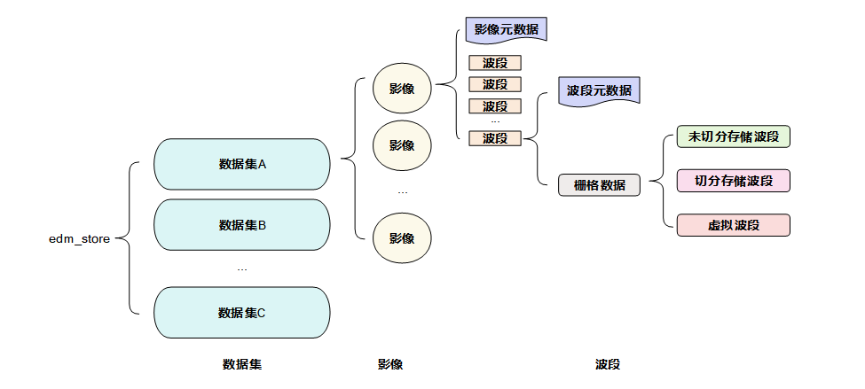
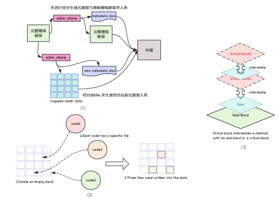
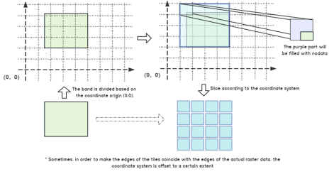
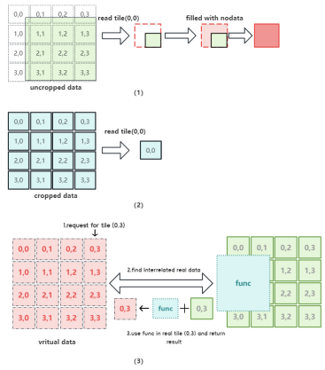
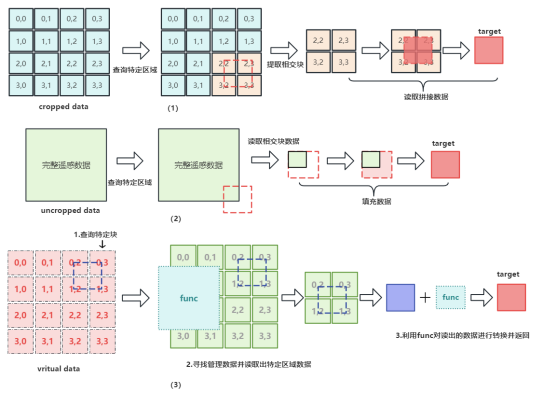
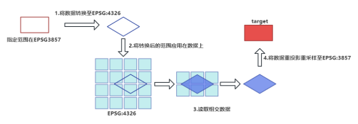
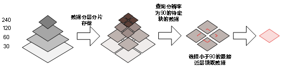
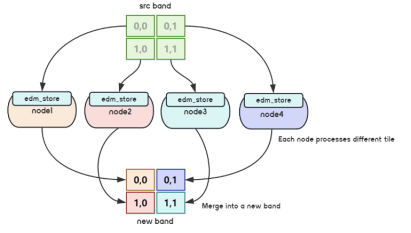

# 详细说明

## 概念
为了更好地管理遥感数据，edm_store函数库将遥感数据按照不同的层级划分为：数据集(Dataset)、影像(Image)、波段(Band)。数据集是由多个影像组成的，
影像是由多个波段构成的，波段是EDMStore中处理遥感数据的最小单元。在本函数库中，波段有三种存在形式：未切分的波段，切分的波段和虚拟的波段。用户在
访问遥感数据时，需要先指定数据集的名称，然后才能访问该数据集下的影像和波段。整体概念图如下所示：

### 切分波段(SlicedBand)

切分波段会将数据按照内置的全球网格进行切分`GlobalTile`，这一类数据也是edm_store中的主要的处理对象，数据会物理层面上进行切分，并切分快保存
块与块之间是相互独立的，对这样的数据支持读方法(`read_tile`,`read_region`) 也支持写方法(`write_tile`, `write_region`)。

### 未切分波段(UnslicedBand)

未切分波段在逻辑层面上也是以`GlobalTile`进行切分的，但是在物理层面上并没有进行切分存储，只支持读取方法(`read_tile`,`read_region`)，在读取
到实际数据外的范围时，会使用`nodata`数据进行填充

### 虚拟波段(VrtBand, RasterioBand)

虚拟波段`VrtBand`一般用于保存中间结果，或者对SlicedBand，UnslicedBand或者RasterioBand在读取时进行一定程度的封装。`RasterioBand`主要是
对于未存储在edm_store的数据也希望使用edm_store的分块的方式进行读取时，可以将数据以这种方式打开，之后的使用方式与`UnslicedBand`类似

## 创建数据

创建数据主要分为对于三类栅格数据的创建（未切分波段数据，切分波段数据，虚拟波段数据），在EDMStore中对于三类数据创建方法如图所示：

- EDMStore可以以一个完整的栅格数据为基准，将其提取出元数据并保存到存储后端（这种操作适用于只需要读取数据的场景），
  或者将其切分成多个Tile并生成新的元数据一同保存到存储后端;
- EDMStore可以创建一个空的波段（参数由用户指定或者使用默认参数），然后由不同的处理节点向其中的每个Tile写入数据，从而生成一个新的波段数据。
  这种操作适用于需要读写数据的场景;
- EDMStore可以在一个已有的波段或者一个虚拟的波段的基础上，结合一个特定的函数，生成一个虚拟的波段。这种操作不会占用实际的存储空间，
  只有在调用波段的读写方法时，才会将函数应用于基础波段，得到所需的数据。这种操作适用于需要对数据进行变换或计算的场景。

如何从一个完整的波段转换成一个分块的波段数据，主要方式如下：

为了对遥感数据进行切分，所有波段都会以自身坐标系的（0，0）点作为原点，按照自身分辨率进行切分。为了减少边缘的Tile中只包含少量数据的情况，
有时候会对原点进行适当的偏移，使得波段的边界和切分的边界尽量重合。切分后的Tile中，如果有部分区域没有数据，会用设定好的Nodata值进行填充，
从而生成一个新的切分后的波段。除了实际切分数据，还可以对数据进行虚拟切分，这样不会改变数据的存储， 只会生成一个新的虚拟切分波段，它具有和实际切分波段相同的切分方式和元数据

## 读取数据

EDMStore函数库提供了两种方式来读取遥感数据：一种是按照Tile为单位，一种是按照指定范围。这里我们先介绍按照Tile为单位的方式。 这种方式主要适用于三种类型的数据：未切分数据，切分数据，和虚拟数据。

在EDMStore内部，有一个全局切分的工具类，可以对相同坐标系下的数据进行统一切分。 因此，对于未切分的数据，我们会先对其进行虚拟切分，然后按照Tile的编号来读取或写入数据。
如果Tile中有缺失的数据，我们会用Nodata值进行填充。对于已经切分的数据，我们可以直接访问其对应的Tile。对于虚拟数据，它一般是由包含实际数据的波段和一个特定的函数组成的。
当我们读取虚拟数据的某个Tile时，我们会先读取其关联的实际数据的Tile，然后用函数对其进行转换，得到虚拟数据的Tile。

具体如下图所示：

EDMStore函数库还提供了另一种方式来读取遥感数据：按照指定范围。这种方式主要适用于以下三种情况：

- 读取切分数据的指定范围：EDMStore会根据用户传入的范围，检索出与之相交的Tile，然后从每个Tile中提取出相交的部分，拼接成一个完整的数据，返回给用户。
- 读取未切分数据的指定范围：EDMStore会计算用户传入的范围和数据的实际范围的交集，然后从数据中提取出交集的部分，返回给用户。
  如果用户传入的范围超出了数据的实际范围，那么超出的部分会用Nodata值进行填充。
- 读取虚拟数据的指定范围：EDMStore会先找到虚拟数据关联的实际数据，然后按照上述两种情况的方法，从实际数据中提取出指定范围的数据，
  然后用虚拟数据的函数对其进行转换，返回给用户。

具体如下图所示：

在EDMStore中也支持对于对于数据的重投影重采样以及对于数据的分层读写：
如果用户指定的查询范围和数据的坐标系不一致，EDMStore会先将查询范围转换到数据的坐标系下，然后按照上述方法从数据中提取出相应的数据，
最后再将数据进行重投影和重采样用户指定的坐标系下，返回给用户。

具体如下所示：

当传入了分辨率来进行查询时，会在目标数据中的金字塔层级中选择小于等于指定分辨率的层级进行查询，之后在该层级总凭借读取数据，重采样至对应分辨率返回给用户。

具体如下图所示：

## 写数据

EDMStore函数库只支持对切分后保存的数据进行写入操作。用户可以将不同的Tile分配给不同的机器或进程来处理，这样不会影响其他Tile的数据，从而实现对同一栅格数据分布式读写的功能

具体如下图所示：

EDMStore函数库可以利用多个节点来处理和写入遥感数据。每个节点可以访问原始数据中的某个Tile，进行处理。
原始数据可以是切分数据、虚拟切分数据、或虚拟数据。处理后的数据可以写入到一个新的波段中，按照Tile的编号进行存储。
这样就形成了一个由多个节点共同创建的新的波段数据。如果新的波段数据中有些Tile没有数据，那么在访问这些Tile时，会返回一个用Nodata值填充的数据。
